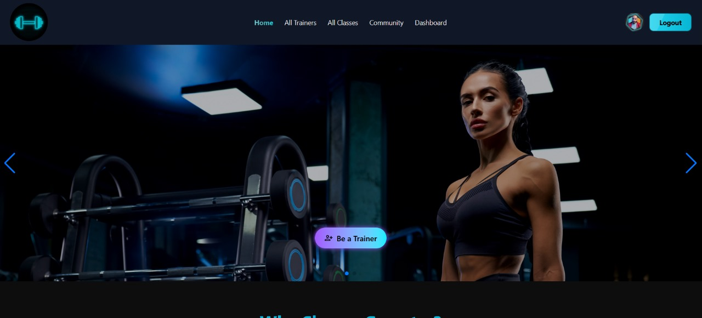

# React + Vite

# 🏋️‍♂️ GYMETRY – Your Ultimate Fitness Companion

GYMETRY is a full-featured MERN stack Fitness Tracker web application that connects users with expert trainers, interactive classes, and a vibrant fitness community. Designed with performance, user experience, and modern aesthetics in mind, GYMETRY offers dynamic features for Admins, Trainers, and Members.

---

## 🌐 Live Website:
🔗 [https://gymetry-9566f.web.app](https://gymetry-9566f.web.app)

---

## 🔐 Admin Credentials:
- **Email:** admin@gmail.com  
- **Password:** Admin123@

----------------------

## 🚀 Key Features:

1. **Role-Based Authentication System** – Admin, Trainer, and Member with JWT token-based protected routes.
2. **Responsive UI** – Fully optimized for Desktop, Tablet, and Mobile devices.
3. **Secure Login & Registration** – Firebase Authentication with email/password and social login support.
4. **Trainer Application Flow** – Members can apply to become Trainers with pending status.
5. **Slot Booking System** – Book trainer time slots, select membership packages, and make payments via Stripe.
6. **Payment System** – Stripe-based secure payment integration and booking confirmation system.
7. **Dynamic Dashboard** – Role-specific dashboards with complete control over features and data.
8. **Community Forum** – Forum page with upvote/downvote system and admin/trainer badges.
9. **Admin Features** – Add classes, manage trainers, review applicants, view financial charts, and subscriber stats.
10. **Newsletter & Review System** – Users can subscribe to newsletters and leave star-rated feedback on trainers.

---

## 📁 Technologies Used:

- **Frontend:** React.js, TailwindCSS, React Router, React Helmet, React Select, React Hook Form, TanStack Query, Stripe Elements
- **Backend:** Node.js, Express.js, MongoDB, JWT Authentication
- **Authentication:** Firebase Authentication (email/password + social)
- **UI Libraries:** Tailwind CSS, SweetAlert2, Neon-styled custom components
- **Data Visualization:** Recharts (Pie Chart / Bar Chart)

//Hello world
---

## 🧠 Project Structure:

/client
/src
/components
/pages
/contexts
/hooks
/dashboard
/utils
/server
/routes
/controllers
/models
/middlewares
server.js

---

## 💡 Notable Implementations:

- ✅ Protected Routes using JWT stored in localStorage
- ✅ Stripe Payment Gateway Integration with booking data persistence
- ✅ Admin Reject Feedback with Modal and Dynamic Status Updates
- ✅ Forum Post Voting Logic with Role-Based Badges
- ✅ Trainer & Class Management with Pagination and Filtering
- ✅ Home Page: Banners, Featured Classes, Testimonials, Team, Newsletter, Community Preview

---

## 📊 Admin Dashboard Functionalities:

- ✔️ View all newsletter subscribers
- ✔️ Manage Trainers (approve/reject applications)
- ✔️ Add/Edit/Delete Classes
- ✔️ View financial statistics and recent transactions
- ✔️ Visual Pie/Bar Chart (Subscribers vs Paid Members)

---

## 🧑‍🏫 Trainer Dashboard Functionalities:

- ✔️ Add and Manage Available Slots
- ✔️ Select Classes to teach
- ✔️ View Booked Slots with member info
- ✔️ Post on Community Forum

---

## 👥 Member Dashboard Functionalities:

- ✔️ Book Trainers & Choose Membership Packages
- ✔️ Activity Log with Rejection Feedback
- ✔️ Profile Management (Update photo/name)
- ✔️ Leave Reviews with Star Ratings
- ✔️ View Booked Trainers and Class Info

---

## 🧪 Extra Features:

- 🔍 **Search Functionality** on All Classes (Backend Search, Case-insensitive)
- 📅 **Pagination** on All Classes and Forum Posts
- 💬 **Toast/Sweet Alerts** for all user actions
- 📌 **Dynamic Page Titles** using `react-helmet`

---

## 🧾 Environment Variables Used:

> Firebase Config & MongoDB Credentials are secured using environment variables in both frontend and backend.

---

## ✅ Deployment:

- **Client:** Firebase Hosting  
- **Server:** Vercel

---

## 📸 Screenshots:

> (Optional – You can embed homepage, dashboard, booking, payment, and forum screenshots here)

---

## 📌 GitHub Repositories:

- **Client Repo:** [GitHub Link](#)
- **Server Repo:** [GitHub Link](#)

---

## 📢 Credits:

- Designed & Developed by **Rafi Uddin**
- UI Inspired from Behance, Dribbble, and custom-designed
- Iconography & assets from FontAwesome & Heroicons

---

## 🥳 Thank You!

Feel free to explore and fork the project. Contributions and suggestions are welcome!

🚀 How to Run Locally
1️⃣ Clone the repository
git clone https://github.com/Rafi024124/Cholo-Kotha-Boli-App.git

2️⃣ Go to the project folder
cd Cholo-Kotha-Boli-App

3️⃣ Install backend dependencies
cd server
npm install

4️⃣ Create a .env file in the server folder
Add your environment variables like:
MONGO_URI=your_mongodb_connection_string JWT_SECRET=your_jwt_secret FIREBASE_API_KEY=your_firebase_api_key

5️⃣ Start the backend server
npm run start

6️⃣ Install frontend dependencies
Open a new terminal tab/window, then:
cd ../client
npm install

7️⃣ Start the frontend
npm start

8️⃣ Open your browser and go to
http://localhost:3000

it is to make sure that git is detecting the change !!!!

This template provides a minimal setup to get React working in Vite with HMR and some ESLint rules.

Currently, two official plugins are available:

- [@vitejs/plugin-react](https://github.com/vitejs/vite-plugin-react/blob/main/packages/plugin-react) uses [Babel](https://babeljs.io/) for Fast Refresh
- [@vitejs/plugin-react-swc](https://github.com/vitejs/vite-plugin-react/blob/main/packages/plugin-react-swc) uses [SWC](https://swc.rs/) for Fast Refresh

## Expanding the ESLint configuration

If you are developing a production application, we recommend using TypeScript with type-aware lint rules enabled. Check out the [TS template](https://github.com/vitejs/vite/tree/main/packages/create-vite/template-react-ts) for information on how to integrate TypeScript and [`typescript-eslint`](https://typescript-eslint.io) in your project.
